<div align="center">

# 🔐 TechStore — Autenticación, MFA e IAM

### Sistema de gestión de inventario multi-tienda con control de acceso por rol, MFA obligatorio y reflejo real en AWS IAM

[](https://www.python.org/)
[](https://fastapi.tiangolo.com/)
[](https://react.dev/)
[](https://www.postgresql.org/)
[](https://aws.amazon.com/iam/)

</div>

---

## 📌 Sobre este proyecto

**TechStore** es el caso de estudio del laboratorio **GLAB-S08** (*Desarrollo de Soluciones en la Nube*, Tecsup): una cadena de tiendas de tecnología con inventario propio por local y 4 perfiles de usuario con permisos distintos. El proyecto cubre, de punta a punta:

- **Autenticación robusta:** registro con política de contraseña, login con bloqueo tras intentos fallidos, **MFA TOTP obligatorio** para todos los roles, y **login social con Google y GitHub** (que también exige MFA).
- **Control de acceso por rol y por tienda**, aplicado y verificado en el servidor, nunca solo en la interfaz.
- **Auditoría completa** de toda acción sensible, como espejo de lo que AWS CloudTrail hace a nivel de cuenta.
- **La misma lógica de menor privilegio, llevada a una cuenta real de AWS**: los 4 roles de la aplicación se reflejan como grupos de IAM, con políticas propias, MFA obligatorio y verificación de rechazos.

El proyecto se trabajó en 4 etapas:

| Etapa | Contenido | Responsable | Estado |
|---|---|---|---|
| 1 — Planificación | Alcance, stack, modelo de datos, contrato, decisiones | Chat | ✅ |
| 2 — Desarrollo | Backend, frontend, Docker | Agente de IA | ✅ 8 fases (D1–D8) |
| 3 — Testing | Matriz de permisos, seguridad, E2E, cobertura | Agente de IA | ✅ 226 pruebas, cobertura 90.81 %, 6/6 E2E |
| **4 — Infraestructura AWS** | **IAM, grupos, MFA, CloudTrail, Access Analyzer** | **Manual** | ✅ |

> 📄 La especificación técnica completa, con las 20 decisiones de diseño y el registro fase a fase, vive en [`CONTEXT.md`](CONTEXT.md).

---

## 🏗️ Arquitectura

### La aplicación

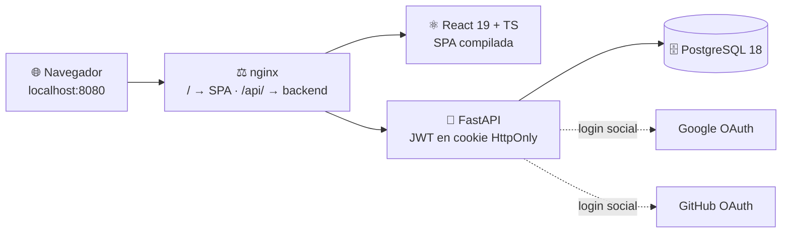

### El reflejo en AWS IAM (Etapa 4)

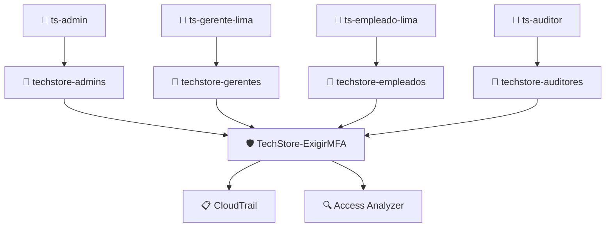

---

## 🛠️ Stack técnico

| Capa | Tecnología |
|---|---|
| Backend | Python 3.14 · FastAPI · SQLAlchemy + Alembic · PyJWT · PyOTP · bcrypt · cryptography (Fernet) |
| Frontend | React 19 · TypeScript · Vite · react-router · qrcode.react |
| Base de datos | PostgreSQL 18 |
| Pruebas | pytest + pytest-cov (backend) · Playwright (E2E) |
| Infraestructura | Docker Compose (db + migrate + backend + frontend tras nginx) |
| Seguridad en la nube | AWS IAM, MFA virtual, CloudTrail, IAM Access Analyzer |

---

## 👥 Actores y matriz de permisos

| Acción | Administrador | Gerente | Empleado | Auditor |
|---|---|---|---|---|
| Ver productos (todas las tiendas) | ✓ | ✓ | ✓ | ✓ |
| Crear / editar / **precio** | Cualquier tienda | Su tienda | ✗ | ✗ |
| Actualizar **stock** | Cualquier tienda | Su tienda | Su tienda | ✗ |
| Eliminar producto | Cualquier tienda | Su tienda | ✗ | ✗ |
| Reporte de inventario | Todas | Solo su tienda | ✗ | Todas |
| Bitácora de auditoría | ✓ | ✗ | ✗ | ✓ |
| Usuarios, roles, tiendas | ✓ | ✗ | ✗ | ✗ |

**Denegación por defecto** y verificación en el servidor en cada petición — nunca solo en la interfaz. Detalle completo en la sección 4 y 9 de [`CONTEXT.md`](CONTEXT.md).

---

## 🚀 Puesta en marcha

<details>
<summary><strong>Modo desarrollo (backend y frontend nativos)</strong></summary>

<br>

```powershell
git clone https://github.com/diegoninam-ship-it/Lab08-DNS.git
cd Lab08-DNS

docker compose up -d db          # PostgreSQL en el puerto 5434

cd backend
python -m venv venv
venv\Scripts\activate
pip install -r requirements-dev.txt
copy ..\.env.example ..\.env     # completar secretos (ver abajo)
alembic upgrade head
python -m app.seed
uvicorn app.main:app --reload --port 8000

# en otra terminal
cd ..\frontend
npm install
npm run dev                      # sirve en :8080 con proxy /api → :8000
```

**Generar los secretos obligatorios del `.env`:**

```powershell
python -c "import secrets; print(secrets.token_urlsafe(48))"                              # JWT_SECRET
python -c "from cryptography.fernet import Fernet; print(Fernet.generate_key().decode())"  # MFA_CLAVE_CIFRADO
```

</details>

<details>
<summary><strong>Stack completo con Docker Compose</strong></summary>

<br>

```powershell
docker compose up -d --build
```

Levanta `db`, `migrate` (migración + datos semilla, tarea única), `backend` y `frontend` (nginx en `:8080`). Accede en `http://localhost:8080`.

</details>

<details>
<summary><strong>Pruebas</strong></summary>

<br>

```powershell
cd backend
pytest                           # 226 pruebas, cobertura 90.81%

cd ..\frontend
npx playwright test              # 6/6 E2E contra el stack completo
```

</details>

---

## 🔑 Datos semilla

| Email | Rol | Tienda |
|---|---|---|
| `admin@techstore.pe` | ADMIN | Lima Centro |
| `gerente.lima@techstore.pe` | GERENTE | Lima Centro |
| `empleado.lima@techstore.pe` | EMPLEADO | Lima Centro |
| `auditor@techstore.pe` | AUDITOR | Lima Centro |

Contraseña de todos: `Demo1234!`. Ninguno tiene MFA preconfigurado — el primer ingreso de cada uno pide escanear el QR (la clave también se muestra en texto, debajo del QR).

---

## 🔐 Etapa 4 — IAM, MFA y CloudTrail en AWS

A diferencia de las etapas 2 y 3 (desarrolladas por un agente de IA), esta etapa se ejecutó **manualmente**, aplicando sobre una cuenta real de AWS los mismos principios de menor privilegio que gobiernan TechStore — pero ahora sobre la propia consola de AWS.

### Qué se construyó

| Elemento | Detalle |
|---|---|
| Usuarios IAM | `ts-admin`, `ts-gerente-lima`, `ts-empleado-lima`, `ts-auditor` — todos con MFA virtual (TOTP) |
| Grupos | `techstore-admins` (`AdministratorAccess`), `techstore-gerentes` (`ViewOnlyAccess`), `techstore-empleados` (sin política adicional), `techstore-auditores` (`SecurityAudit`) |
| Política propia | `TechStore-ExigirMFA` — niega toda acción sin sesión MFA, salvo que el usuario gestione su propio MFA o contraseña |
| Auditoría | CloudTrail (historial de gestión) + IAM Access Analyzer |

### 🛡️ La política central

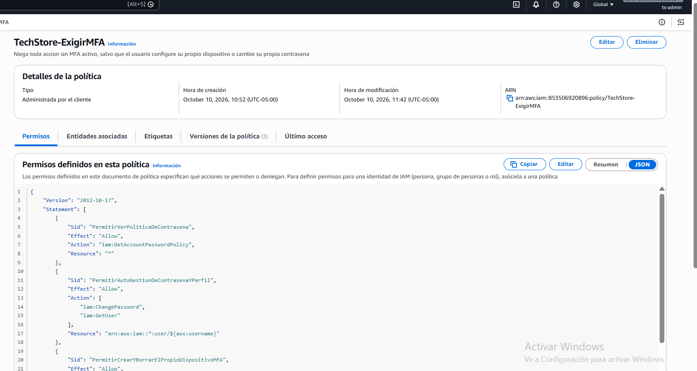

Combina tres conceptos clave de IAM: **condiciones** (`aws:MultiFactorAuthPresent`), **variables de política** (`${aws:username}`, para que cada usuario solo gestione su propio MFA) y **excepciones mínimas** (sin ellas, nadie podría activar su primer MFA).

> 🧪 La pestaña *Versiones de la política (3)* documenta la iteración real: una primera versión con un ARN sin comodín bloqueaba a los usuarios con sufijo en el nombre del dispositivo, y faltaban los `Allow` explícitos — una política hecha solo de `Deny` nunca otorga nada por sí sola. Ambos fallos se corrigieron en vivo.

### 👥 Grupos, usuarios y MFA

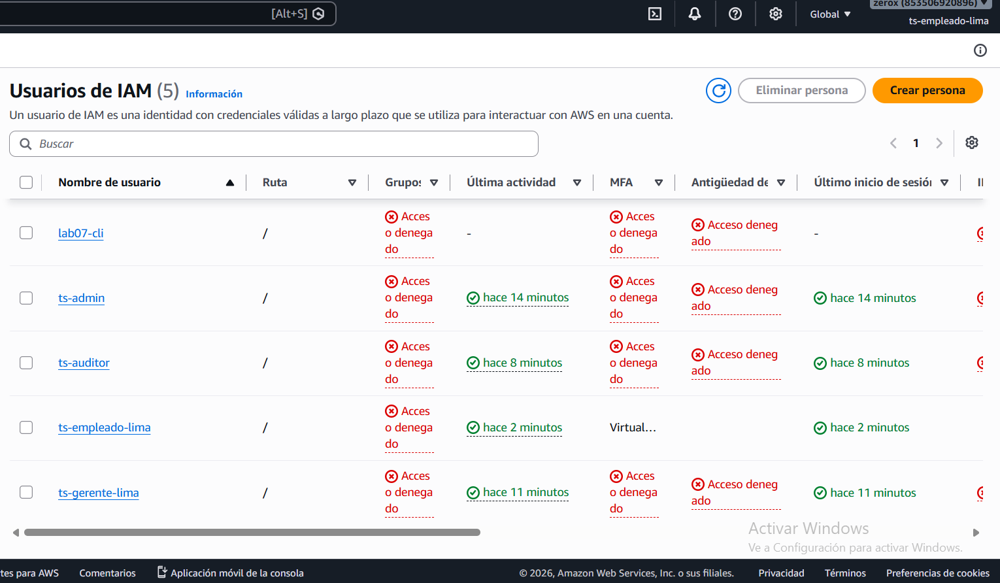

### 🚫 Menor privilegio verificado: 4 rechazos reales

<table>
<tr>
<td width="50%">

**Empleado sin acceso a IAM**
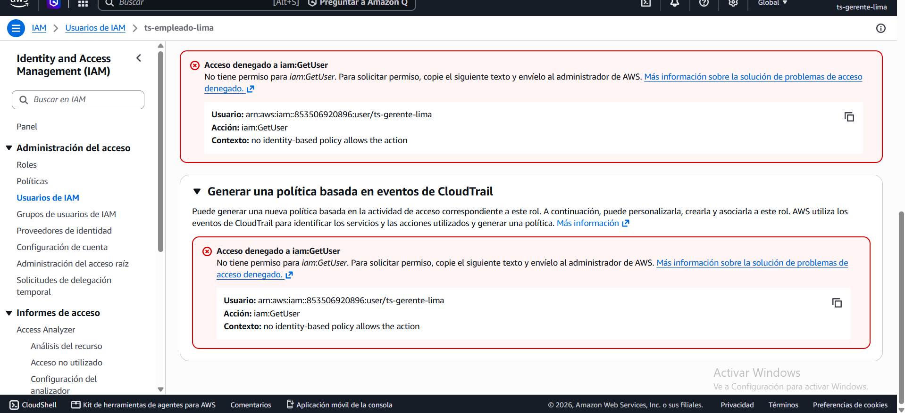

</td>
<td width="50%">

**Gerente: solo lectura**
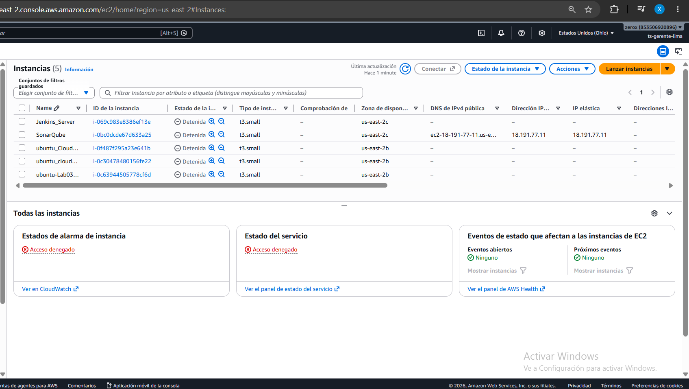

</td>
</tr>
<tr>
<td width="50%">

**Auditor no puede crear usuarios**
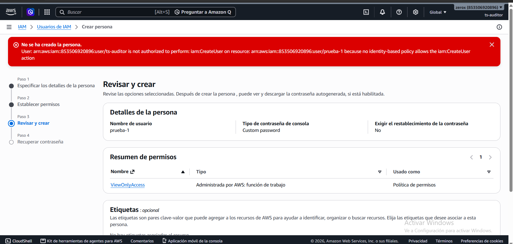

</td>
<td width="50%">

**Nadie gestiona el MFA ajeno**
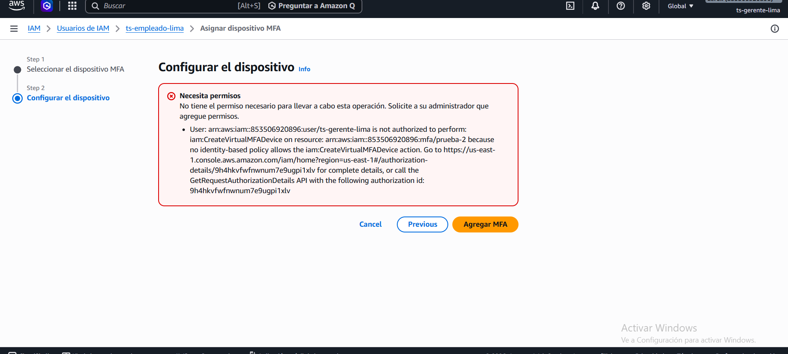

</td>
</tr>
</table>

### 📋 CloudTrail: auditoría de inicios de sesión

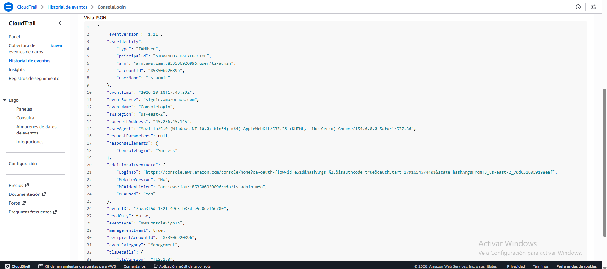

`MFAUsed: "Yes"` confirma que la sesión de `ts-admin` pasó por su dispositivo MFA — el equivalente, a nivel de cuenta AWS, de lo que la tabla `auditoria` de TechStore registra a nivel de aplicación.

### 🔍 Access Analyzer e informe de credenciales

<table>
<tr>
<td width="50%">

**Access Analyzer — 0 hallazgos**
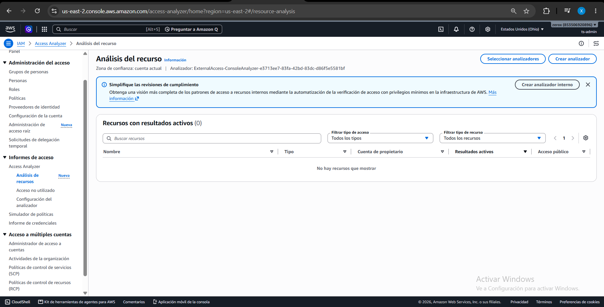

</td>
<td width="50%">

**Informe de credenciales**
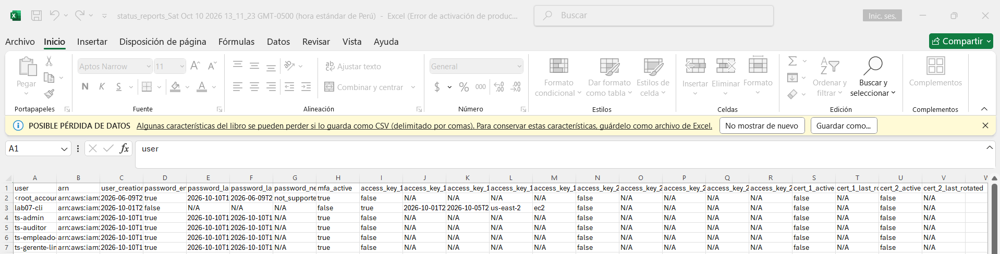

`mfa_active: true` en los 5 usuarios de consola (root incluido); `false` solo en un usuario de otro laboratorio sin acceso a consola.

</td>
</tr>
</table>

### 💡 Lecciones operativas

- Una política hecha solo de `Deny` **nunca otorga** permisos — necesita sus `Allow` explícitos.
- Los ARN dentro de una condición deben **coincidir exactamente**, salvo que se use un comodín.
- Al reemplazar un permiso directo por uno de grupo: **otorgar primero, retirar después** — nunca al revés, o el propio usuario puede quedar sin salida.
- Un solo administrador es un punto único de fallo; por eso la cuenta raíz con MFA se mantiene como respaldo, no se elimina.

---

## 📂 Estructura del repositorio

```
Lab08-DNS/
├── backend/                 # FastAPI: routers, modelos, seguridad, pruebas
├── frontend/                # React 19 + TypeScript + Playwright (e2e/)
├── docker-compose.yml
├── docs/
│   ├── ETAPA4-AWS-IAM.md      # (este contenido, también disponible aparte)
│   ├── TESTING.md             # conteo de pruebas, cobertura, casos E2E
│   └── capturas/               # evidencias de la Etapa 4
├── .env.example
└── CONTEXT.md                # especificación técnica completa
```

---

<div align="center">

**Curso:** Desarrollo de Soluciones en la Nube · **Institución:** Tecsup
**Laboratorio:** GLAB-S08 — TechStore: Autenticación, MFA e IAM

</div>